# Normalizing flows

Reimplementations of density estimation algorithms from:
* [Glow: Generative Flow with Invertible 1×1 Convolutions](https://arxiv.org/abs/1807.03039)
* [Masked Autoregressive Flow for Density Estimation](https://arxiv.org/abs/1705.07057)
* [Density Estimation using RealNVP](https://arxiv.org/abs/1605.08803)
* [Variational Inference with Normalizing Flows](https://arxiv.org/abs/1505.05770)

## Glow: Generative Flow with Invertible 1x1 Convolutions
https://arxiv.org/abs/1807.03039

Implementation of Glow on CelebA and MNIST datasets.

#### Results
I trained two models:
- Model A with 3 levels, 32 depth, 512 width (~74M parameters). Trained on 5 bit images, batch size of 16 per GPU over 100K iterations.
- Model B with 3 levels, 24 depth, 256 width (~22M parameters). Trained on 4 bit images, batch size of 32 per GPU over 100K iterations.

In both cases, gradients were clipped at norm 50, learning rate was 1e-3 with linear warmup from 0 over 2 epochs. Both reached similar results and 4.2 bits/dim.

##### Samples at varying temperatures
Temperatures ranging 0, 0.25, 0.5, 0.6, 0.7, 0.8, 0.9, 1 (rows, top to bottom):

| Model A | Model B |
| --- | --- |
| 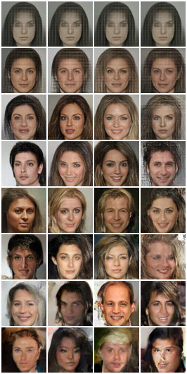 | 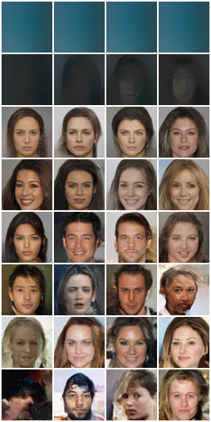 |

##### Samples at temperature 0.7:
| Model A | Model B |
| --- | --- |
|  | 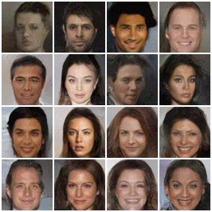 |

##### Model A attribute manipulation on in-distribution sample:

Embedding vectors were calculated for the first 30K training images and positive / negative attributes were averaged then subtracting. The resulting `dz` was ranged and applied on a test set image (middle image represents the unchanged / actual data point).

| Attribute | `dz` range [-2, -1, 0, 1, 2] |
| --- | --- |
| Brown hair |  | 
| Male |  |
| Mouth slightly opened |  |
| Young |  |

##### Model A attribute manipulation on 'out-of-distribution' sample (i.e. me):

| Attribute | `dz` range |
| --- | --- |
| Brown hair |  |
| Mouth slightly opened |  |


#### Usage

To train a model using pytorch distributed package:
```
python -m torch.distributed.launch --nproc_per_node=NUM_GPUS_YOU_HAVE \
       glow.py --train \
               --distributed \
               --dataset=celeba \
               --data_dir=[path to data source] \
               --n_levels=3 \
               --depth=32 \
               --width=512 \
               --batch_size=16 [this is per GPU]
```
For larger models or image sizes add `--checkpoint_grads` to checkpoint gradients using pytorch's library. I trained a 3 layer / 32 depth / 512 width model with batch size of 16 without gradient checkpointing and a 4 layer / 48 depth / 512 width model with batch size of 16 which had ~190M params so required gradient checkpointing (and was painfully slow on 8 GPUs).


To evaluate model:
```
python glow.py --evaluate \
               --restore_file=[path to .pt checkpoint] \
               --dataset=celeba \
               --data_dir=[path to data source] \
               --[options of the saved model: n_levels, depth, width, batch_size]
```

To generate data from a trained model:
```
python glow.py --generate \
               --restore_file=[path to .pt checkpoint] \
               --dataset=celeba \
               --data_dir=[path to data source] \
               --[options of the saved model: n_levels, depth, width, batch_size] \
               --z_std=[temperature parameter; if blank, generates range]
```

To generate data from a trained model:
```
python glow.py --visualize \
               --restore_file=[path to .pt checkpoint] \
               --dataset=celeba \
               --data_dir=[path to data source] \
               --[options of the saved model: n_levels, depth, width, batch_size] \
               --z_std=[temperature parameter; if blank, uses default] \
               --vis_attrs=[list of indices of attribute to be manipulated, if blank, manipulates every attribute] \
               --vis_alphas=[list of values by which `dz` should be multiplied, defaults [-2,2]] \
               --vis_img=[path to image to manipulate (note: size needs to match dataset); if blank uses example from test dataset]
```

#### Datasets

To download CelebA follow the instructions [here](http://mmlab.ie.cuhk.edu.hk/projects/CelebA.html). A nice script that simplifies downloading and extracting can be found here: https://github.com/nperraud/download-celebA-HQ/


#### References
* Official implementation in Tensorflow: https://github.com/openai/glow


## Masked Autoregressive Flow
https://arxiv.org/abs/1705.07057

Reimplementation of MADE, MAF, Mixture of Gaussians MADE, Mixture of
Gausssians MAF, and RealNVP modules on UCI datasets and MNIST.

#### Results
Average test log likelihood for un/conditional density estimation (cf.
Table 1 & 2 in paper for results and parameters; models here were trained for 50 epochs):

| Model | POWER | GAS | HEPMASS | MINIBOONE | BSDS300 | MNIST (uncond) | MNIST (cond) |
| --- | --- | --- | --- | --- | --- | --- | --- |
| MADE | -3.10 +/- 0.02 | 2.53 +/- 0.02 | -21.13 +/- 0.01 | -15.36 +/- 15.06 | 146.42 +/- 0.14 | -1393.67 +/- 1.90 | -1338.12 +/- 1.75 |
| MADE MOG | 0.37 +/- 0.01 | 8.08 +/- 0.02 | -15.70 +/- 0.02 | -11.64 +/- 0.44 | 153.56 +/- 0.28 | -1023.13 +/- 1.69 | -1010.51 +/- 1.64 |
| RealNVP (5) | -0.49 +/- 0.01 | 7.01 +/- 0.06 | -19.96 +/- 0.02 | -16.88 +/- 0.21 | 148.34 +/- 0.26 | -1279.76 +/- 9.91 | -1275.06 +/- 14.23 |
| MAF (5) | 0.03 +/- 0.01 | 6.23 +/- 0.01 | -17.97 +/- 0.01 | -11.57 +/- 0.21 | 153.53 +/- 0.27 | -1272.70 +/- 1.87 | -1270.12 +/- 6.89 |
| MAF MOG (5) | 0.09 +/- 0.01 | 7.96 +/- 0.02 | -17.29 +/- 0.02 | -11.27 +/- 0.41 | 153.35 +/- 0.26 | -1080.46 +/- 1.53 | -1067.12 +/- 1.54 |


Toy density model (cf. Figure 1 in paper):

| Target density | Learned density with MADE <br> and random numbers driving MADE | Learned density with MAF 5 layers <br> and random numbers driving MAF |
| --- | --- | --- |
| 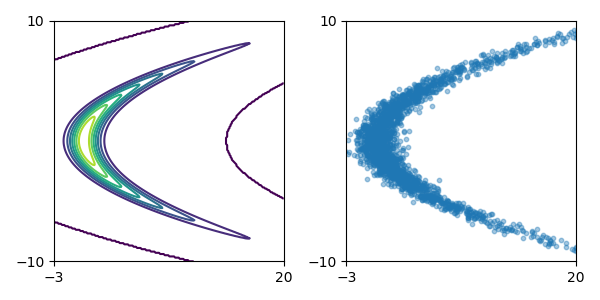 | 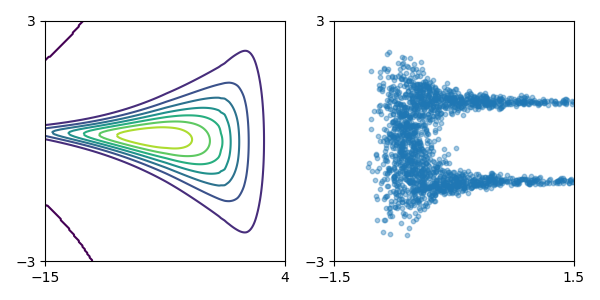 | 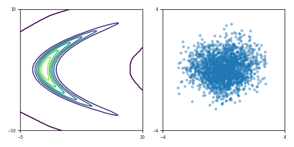 |

Class-conditional generated images from MNIST using MAF (5) model; generated data arrange by decreasing log probability (cf. Figure 3 in paper):

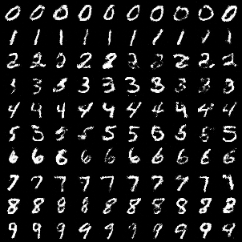

#### Usage
To train model:
```
python maf.py -- train \
              -- model=['made' | 'mademog' | 'maf' | 'mafmog' | 'realnvp'] \
              -- dataset=['POWER' | 'GAS' | 'HEPMASS' | 'MINIBOONE' | 'BSDS300' | MNIST'] \
              -- n_blocks=[for maf/mafmog and realnvp specify # of MADE-blocks / coupling layers] \
              -- n_components=[if mixture of Gaussians, specify # of components] \
              -- conditional [if MNIST, can train class-conditional log likelihood] \
              -- [add'l options see py file]
```

To evaluate model:
```
python maf.py -- evaluate \
              -- restore_file=[path to .pt checkpoint]
              -- [options of the saved model: n_blocks, n_hidden, hidden_size, n_components, conditional]
```

To generate data from a trained model (for MNIST dataset):
```
python maf.py -- generate \
              -- restore_file=[path to .pt checkpoint]
              -- dataset='MNIST'
              -- [options of the saved model: n_blocks, n_hidden, hidden_size, n_components, conditional]
```

#### Datasets

Datasets and preprocessing code are forked from the MAF authors' implementation [here](https://github.com/gpapamak/maf#how-to-get-the-datasets). The unzipped datasets should be symlinked into the `./data` folder or the data_dir argument should be specified to point to the actual data.

#### References
* The original Theano implementation by the authors https://github.com/gpapamak/maf/
* https://github.com/ikostrikov/pytorch-flows


## Variational inference with normalizing flows
Implementation of [Variational Inference with Normalizing Flows](https://arxiv.org/abs/1505.05770)

#### Results
Density estimation of 2-d test energy potentials (cf. Table 1 & Figure 3 in paper).

| Target density | Flow K = 2 | Flow K = 32 | Training parameters |
| --- | --- | --- | --- |
| 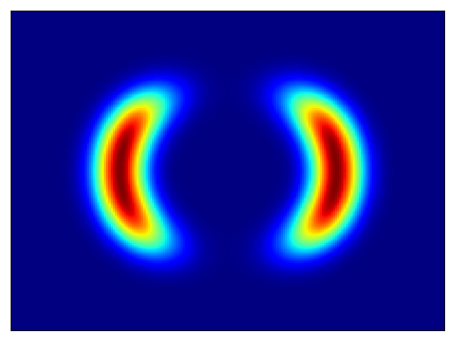 | 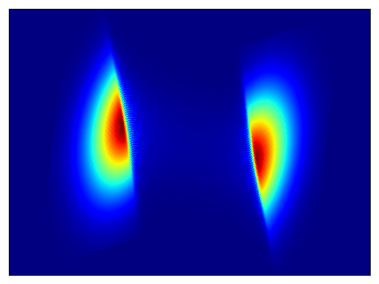 | 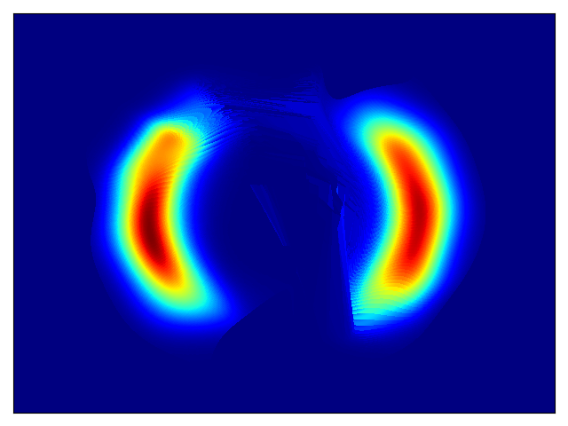 | weight init Normal(0,1), base dist. scale 2 |
| 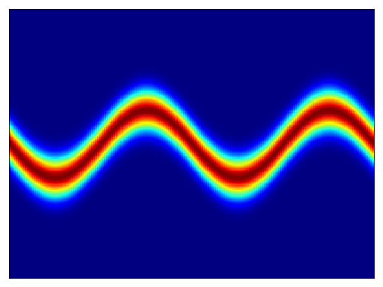 | 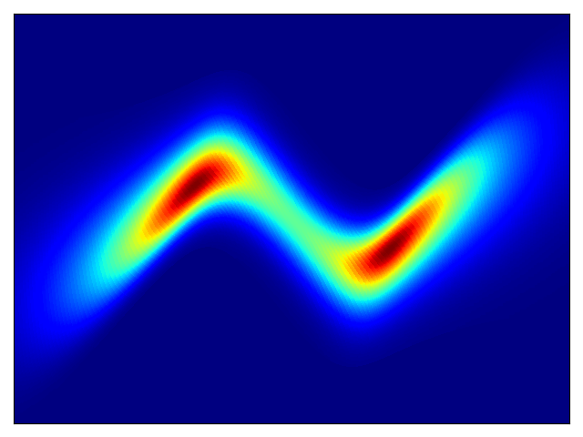 | 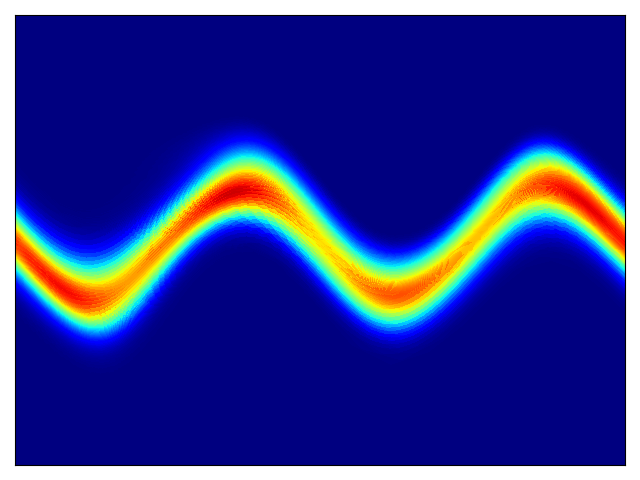 | weight init Normal(0,1), base dist. scale 1 |
| 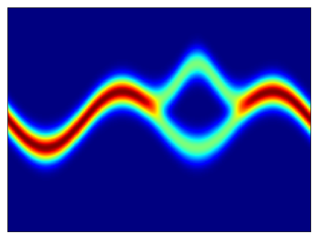 | 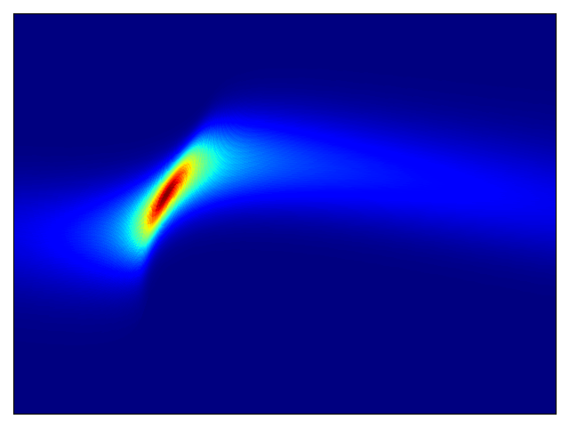 | 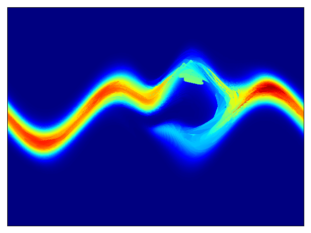 | weight init Normal(0,1), base dist. scale 1, weight decay 1e-3 |
| 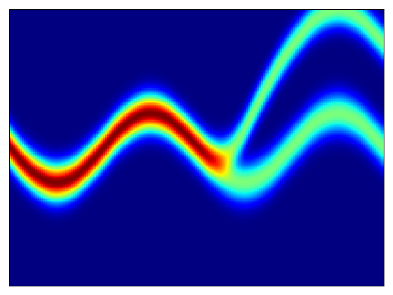 | 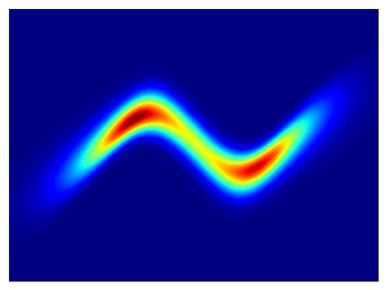 | 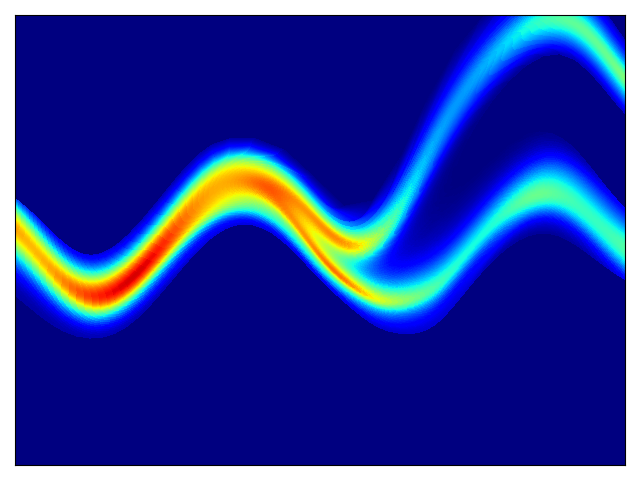 | weight init Normal(0,1), base dist. scale 4, weight decay 1e-3 |


#### Usage
To train model:
```
python planar_flow.py -- train \
                      -- target_potential=[choice from u_z1 | u_z2 | u_z3 | u_z4] \
                      -- flow_length=[# of layers in flow] \
                      -- [add'l options]
```
Additional options are: base distribution (q0) scale, weight initialization
scale, weight decay, learnable first affine layer (I did not find adding an affine layer beneficial).

To evaluate model:
```
python planar_flow.py -- evaluate \
                      -- restore_file=[path to .pt checkpoint]
```

#### Useful resources
* https://github.com/casperkaae/parmesan/issues/22


## Dependencies
* python 3.6
* pytorch 1.0
* numpy
* matplotlib
* tensorboardX

###### Some of the datasets further require:
* pandas
* sklearn
* h5py
